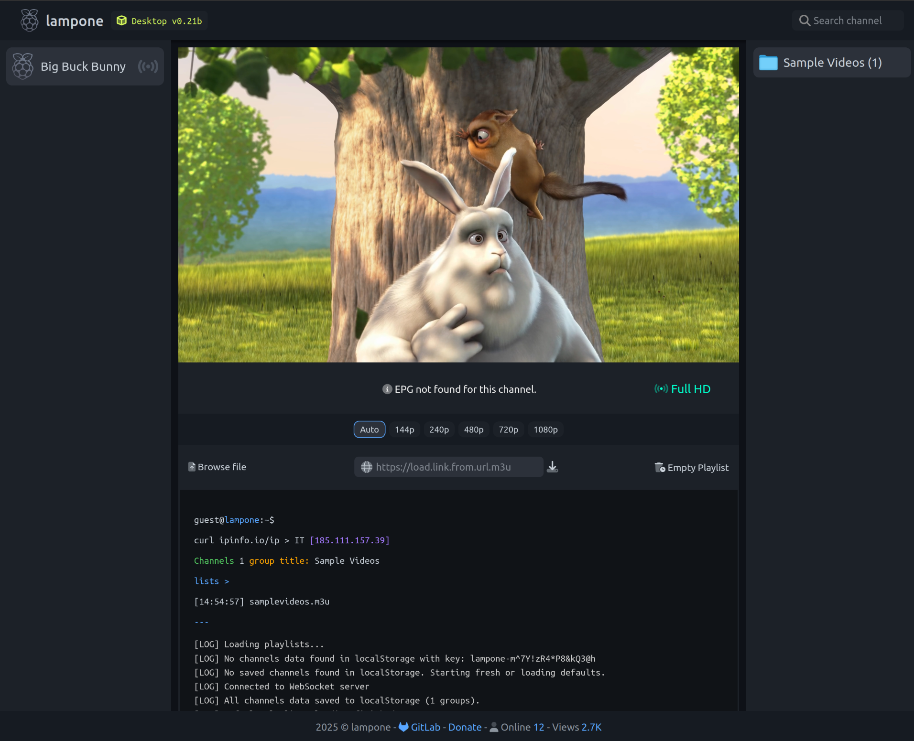

# Lampone - User Guide

## What is Lampone

Lampone is a web-based media player that lets you watch TV streams from M3U/M3U8 playlists directly in your browser. It helps you organize channels by category or country, quickly find what you want to watch, and enjoy a seamless experience with integrated program information (EPG).


- [Lampone UI Demo](https://lampone-ui-4243f6.gitlab.io)
- [Github Repository](https://github.com/jonalinuxdev/lampone)




---

## Key Features for Users

- **Load Your Playlists**: Easily add channels by uploading a local M3U/M3U8 file or pasting a remote playlist URL.
- **Remember Your Channels**: Lampone saves your loaded playlists in the browser (Local Storage), so you don’t have to reload them every time.
- **Organized Channels**: Channels are automatically grouped based on the `group-title` metadata (e.g., country or category), making navigation simple.
- **Quick Navigation**: Switch between channel groups using the icons/flags in the sidebar and browse the channels in each group.
- **Instant Search**: Use the search bar to filter channels in the current list in real time.
- **Smooth Playback**: HLS adaptive streaming with Hls.js, and the option to select video quality if multiple options are available.
- **What’s On Now/Next**: View the current and upcoming TV programs right in the player interface (requires available EPG data).
- **Clean Interface**: The player displays the channel name, logo, and stream quality.
- **Smart Country Selection**: Lampone attempts to detect your country based on your connection and automatically selects the corresponding channel group.
- **Easy Cleanup**: Clear all saved channel data from your browser with a single click.

---

## Quick Start

1. **Download Lampone**: Ensure you have the HTML and CSS files along with the `js/`, `img/`, and `epg/` folders and their contents.
2. **Use a Web Server**: For security reasons, Lampone must be served over HTTP. Simply double-clicking `index.html` won’t work.
   * **Simple Option**: With Python installed, open a terminal in the project folder and run:
     ```bash
     python -m http.server 8000
     ```
   * **Other Options**: Use XAMPP, WAMP, or a Node.js `http-server`.
3. **Open Your Browser** at `http://localhost:8000/` (or the address provided by your server).

---

## How to Use Lampone

### 1. Loading Playlists

- **Saved Playlists**: Lampone first tries to load playlists stored in your browser.
- **Default Playlists**: If none are found, it may load a predefined default list.
- **Add a New Playlist**:
  - **Browse File**: Click “Select M3U File” and choose a `.m3u` or `.m3u8` file from your computer.
  - **Remote URL**: Paste a playlist URL into the input field and click the download icon.

### 2. Selecting Channels

- **Groups**: Pick a channel group (country or category) using the icons/flags on the right.
- **Sidebar**: The left sidebar will display the channels from the selected group.
- **Play a Channel**: Click a channel name in the sidebar to start playback.

### 3. Searching

Type in the “Search channel” box in the header to filter the displayed channels in the sidebar.

### 4. Playback

- The video plays in the main area. Use standard controls (play/pause, volume).
- **Quality**: If multiple quality levels are available (e.g., 720p, 1080p), buttons appear below the player. “Auto” is recommended.

### 5. Program Guide (EPG)

Below the channel name, you’ll see:
- **Now**: the current program.
- **Next**: the upcoming program.  
(Only if the playlist includes `tvg-id` or `tvg-name` for EPG matching.)

### 6. Clearing Saved Data

To remove all playlists saved in your browser:
1. Click the **“Empty Playlist”** button.
2. Confirm the action if prompted.  
The page will reload with a clean state.

---

## Creating a Custom Playlist

Use a text editor (Notepad, VS Code) and follow this example:

```m3u
#EXTM3U
#EXTINF:-1 tvg-id="ChannelID" tvg-name="EPG Name" group-title="Category/Country" tvg-logo="https://example.com/logo.png",Channel Name
http://your_server/stream.m3u8
```

- **#EXTM3U**: required header line.
- **#EXTINF:-1**: precedes each channel.
  - `group-title`: defines the group (e.g., "Italy", "News").
  - `tvg-logo`: URL of the logo image (PNG/JPG/SVG).
  - `tvg-id` / `tvg-name`: useful for EPG matching.
  - Text after the comma: the display name.
- **URL**: the next line is the direct stream URL (ideally `.m3u8` HLS).

Save the file with a `.m3u` or `.m3u8` extension and load it into Lampone.

---

* **Resolution Labels Mapping (from code):**
    Lampone maps stream heights to the following labels for user display:

    | Height (px) | Label             | Notes                     |
    | :---------- | :---------------- | :------------------------ |
    | >= 8640     | 16K Experimental  | Ultra futuristic          |
    | >= 4320     | 8K Ultra HD       |                           |
    | >= 2880     | 5K UltraWide      | e.g., iMac 27" displays   |
    | >= 2160     | 4K Ultra HD       |                           |
    | >= 1600     | WQXGA+ 1600p      | Tall monitors             |
    | >= 1440     | 2K QHD            |                           |
    | >= 1280     | HD+ 1280p         | Improved HD streams       |
    | >= 1080     | Full HD           |                           |
    | >= 1024     | XGA+ 1024p        | Medium-high quality       |
    | >= 720      | HD Ready          |                           |
    | >= 576      | PAL SD 576p       | European standard         |
    | >= 480      | SD 480p           |                           |
    | >= 360      | SD 360p           |                           |
    | >= 240      | Low 240p          |                           |
    | >= 144      | Very Low 144p     |                           |
    | >= 120      | Low 120p          |                           |
    | >= 96       | Retro 96p         | Meme mode / Very low      |
    | default     | undefined         | If height is not matched  |


---


## License

This project is distributed under the **GPLv3** license.


